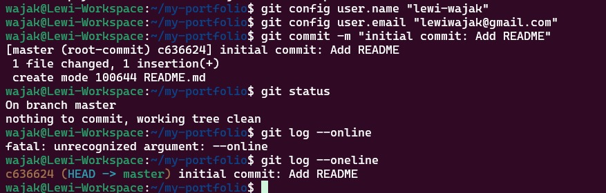
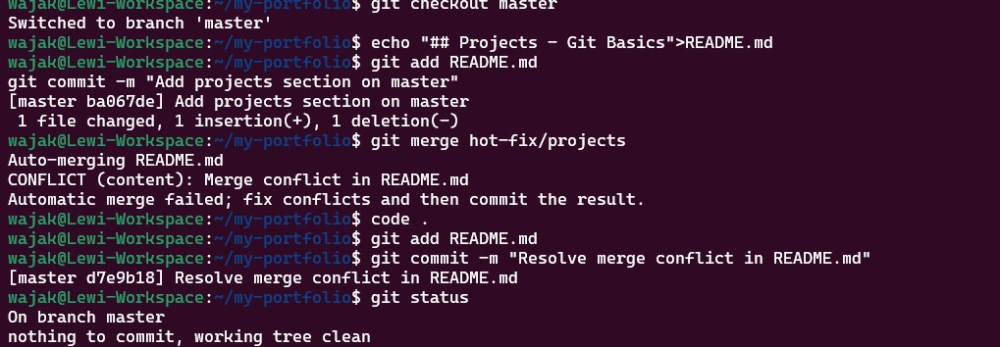
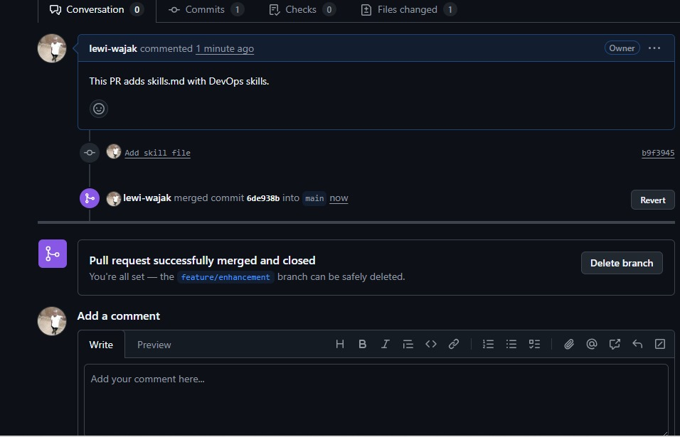

# Lab Report: Git & DevOps Portfolio

## Screenshots

### Checkpoint 1: initial commit

### Checkpoint 2:resolving conflict issues

### Checkpoint 3: Final Repo on GitHub

---

## Reflection

**What was challenging?**  
- i actually had issues with the signing in to github through the ubuntu but i was able to overcome that, next challenge is the typographycal errors.

**How does Git help in DevOps teams?**  
- Git allows multiple team members to work on the same codebase simultaneously.  
- It provides version control, branch management, and the ability to merge changes safely.  
- Pull requests and reviews ensure quality and reduce errors in collaborative projects.

---

## Issues Faced and How They Were Resolved

- **Authentication with GitHub**: Passwords are no longer supported for HTTPS; resolved by generating a Personal Access Token (PAT).  
- **Merge conflicts**: Conflicts occurred when multiple branches edited the same file; resolved by manually combining changes in the file and committing.  
- **Image embedding**: Copy-pasting images didn’t work; resolved by placing screenshots in an `images` folder and linking them in Markdown.

---

